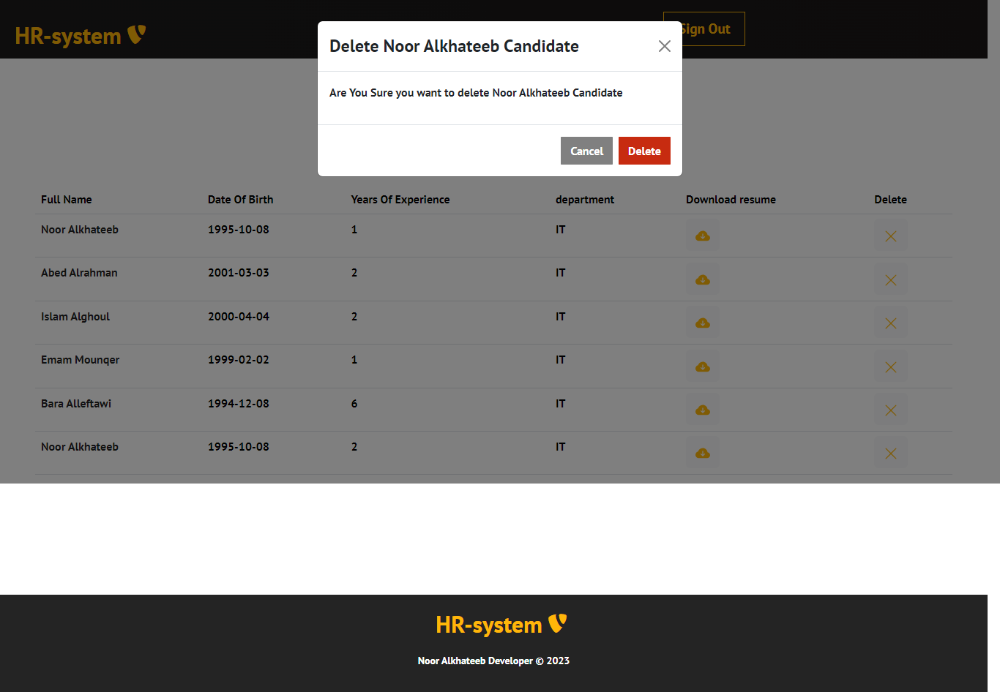

# HR-ResumeManagrequired

## Author

- Author: Noor Alkhateeb
- Email: noor.alkhateeb@gmail.com

## Description

The HR Resume Management System is an API implementation that allows job applicants to register as potential candidates, upload their resumes, and enables HR managers to log in, view the list of candidates, and download their resumes.

## Prerequisites

- Python 3.10
- Node.js

## Installation

### Backend Setup

## to Run Backend Server:

#### Creating a Virtual Environment

`python -m venv .venv`
or

`python3.10 -m venv .venv`

#### Activating the Virtual Environment

`source .venv/bin/activate`

#### Deactivating the Virtual Environment

`deactivate`

#### Installing Backend Dependencies

`pip3 install -r requirements.txt`

#### Running the Django Development Server

`python manage.py runserver`

#### Admin Credentials

**Username = _admin_**
**Password = _admin_**

### Rename HrRecruitmentSystem/.env.sample to .env

### Frontend Setup

#### Installing Frontend Dependencies

`npm install`

#### Starting the Frontend Development Server

`npm start`

#### Admin Credentials

**username = _admin_**
**password = _admin_**

### Usage

#### User Roles
**Job Applicants:** Job applicants can register as candidates and upload their resumes.

**HR Managers:** HR managers can log in to view the list of candidates and download their resumes.

#### Screenshots and Demos

